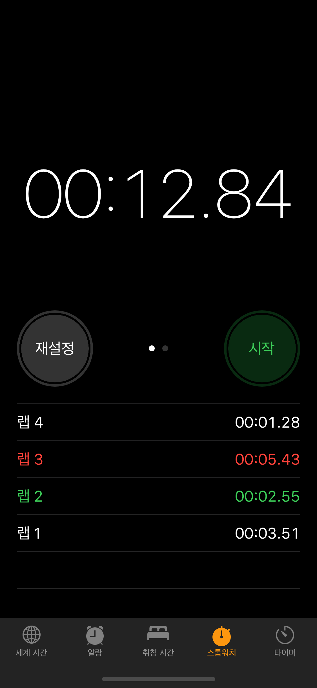
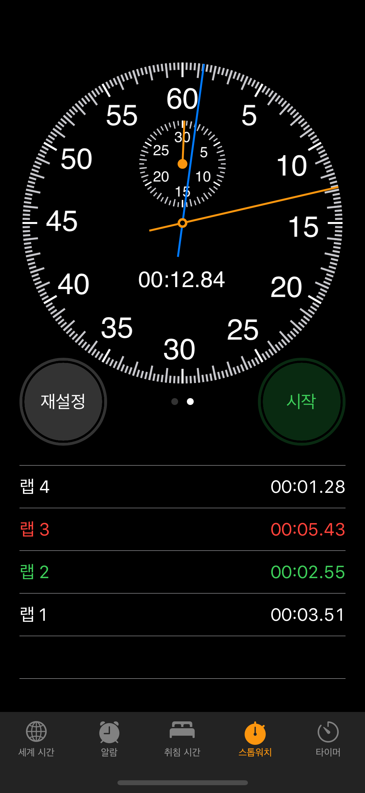
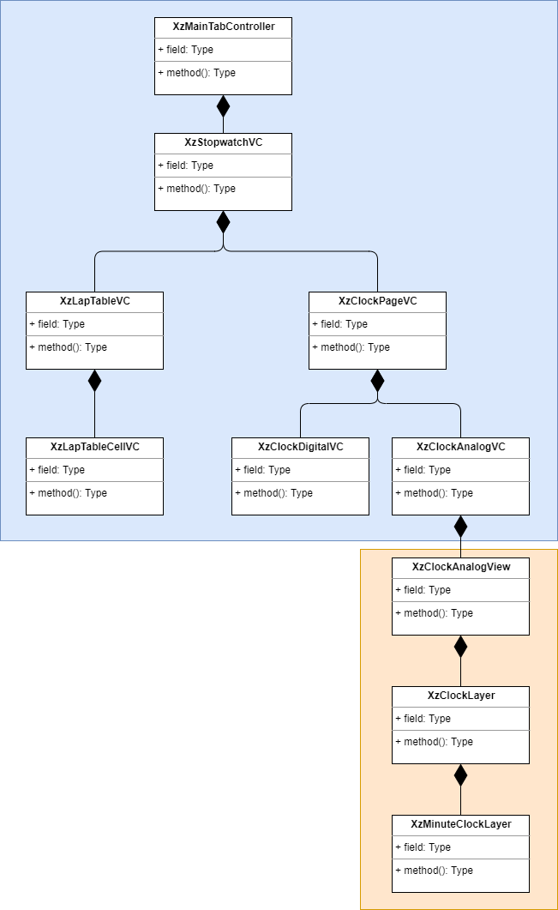

# clock-sample
### 아이폰 시계앱의 스톱워치 기능

##### (시뮬레이터로 실행시 아날로그 시계의 초침 인덱스가 흰색으로 보임. 폰에서 실행시 회색으로 나타남)

결함 시나리오 수정
1. 시작 > 랩 > 중단 > 아날로그 시계로 이동시, "중단"했을 당시의 시간을 나타내지 않는 결함 수정
2. 시작 > 중단 > 시작 > 중단 반복시, 디지털 시계와 아날로그 시계의 시간 동기화되지 않는 결함 수정

미비기능
- app 종료 후 다시 실행시 이전에 내용 사라짐
